# dem01


# dem02


# dem03
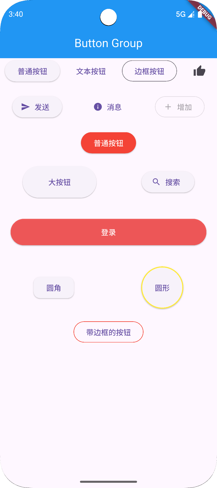

# dem04
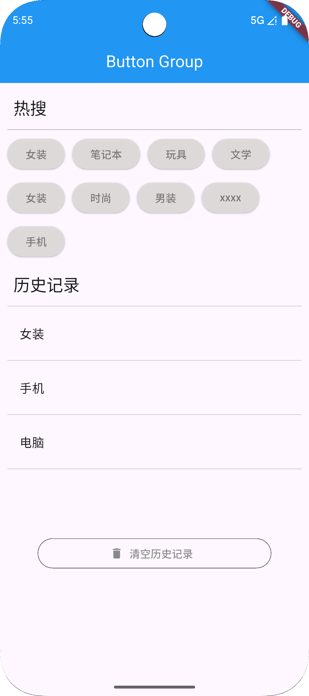

# dem05


# dem06
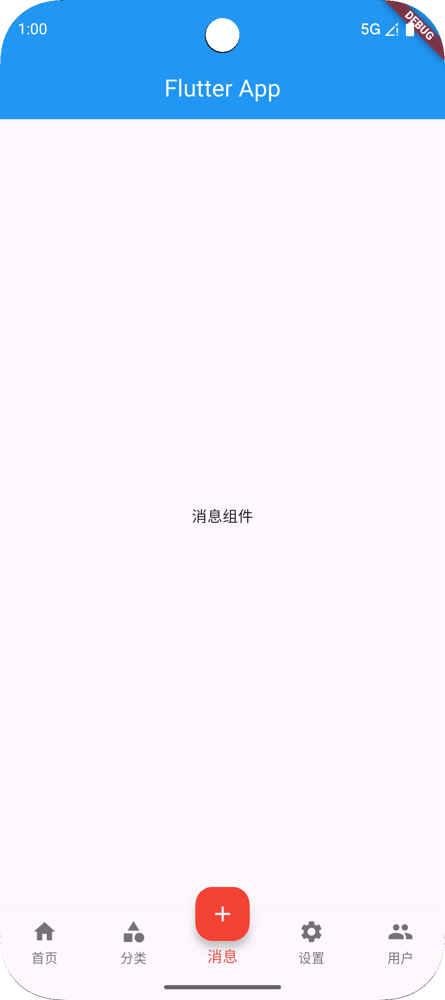

# dem07


# dem08


# dem09


# dem10
* 路由跳转

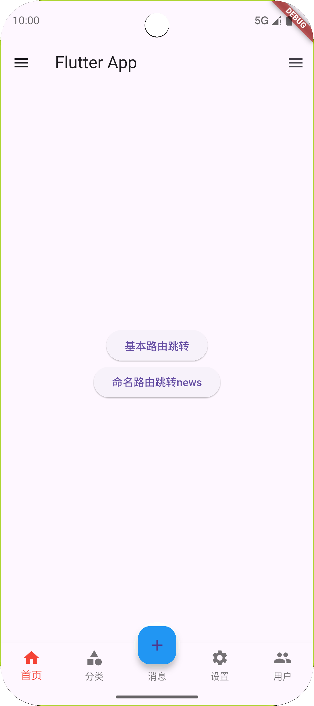

# dem11
* 路由传参跳转


# dem12
* 拆分路由文件


# dem13
* 清空特定路由

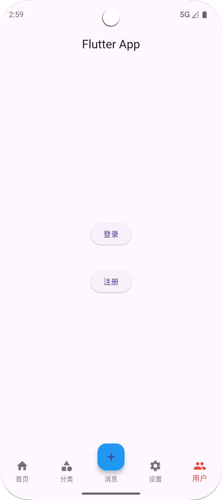

# dem14
* 弹窗

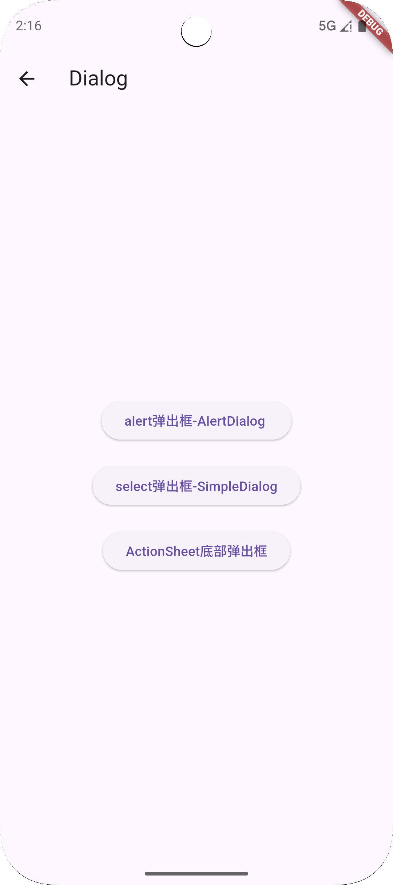

# dem15
* 自定义弹窗


# dem16
* pageview 滑动


# dem17
* pageview 自动滑动和组件缓存

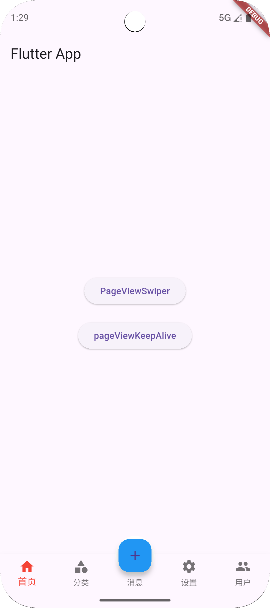

# dem18
* 通过 key 获取widget的状态和方法

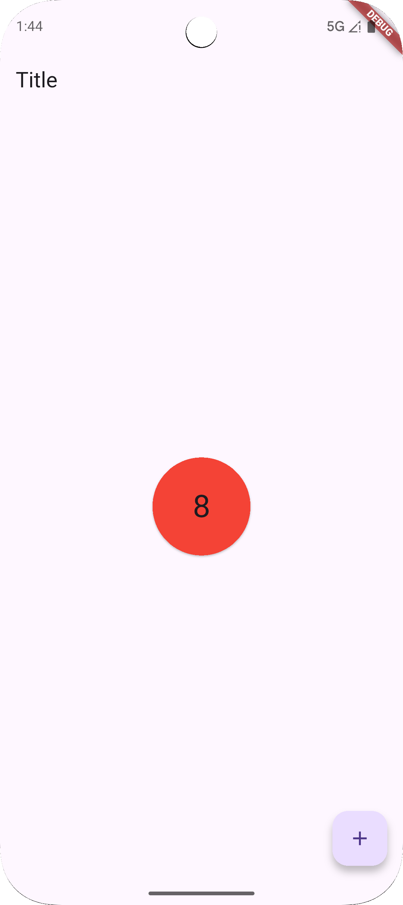

# dem19
* AnimatedList 是一个可以为列表项的插入和删除操作添加动画效果的组件

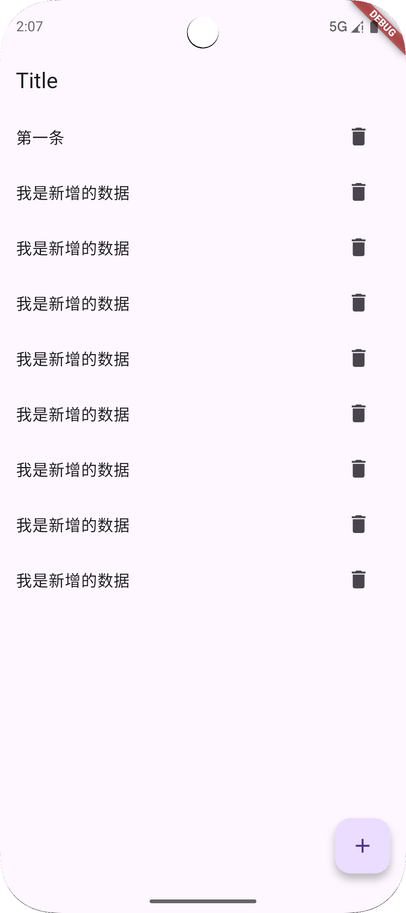

# dem20
* 动画效果内置组件

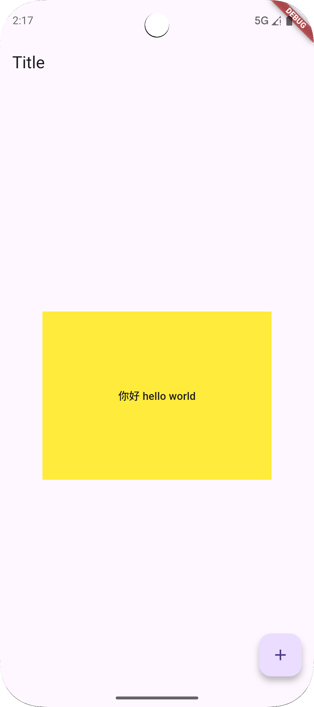

# dem21
* 登录页面


# dem22
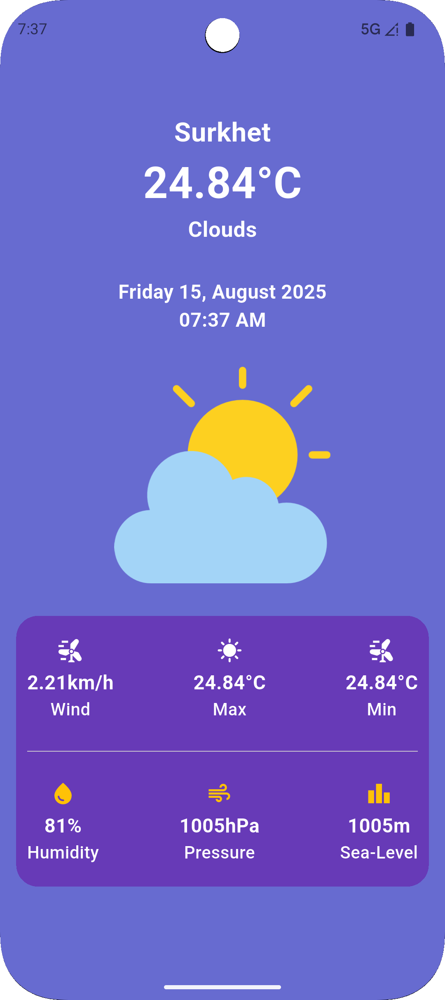


# dem23
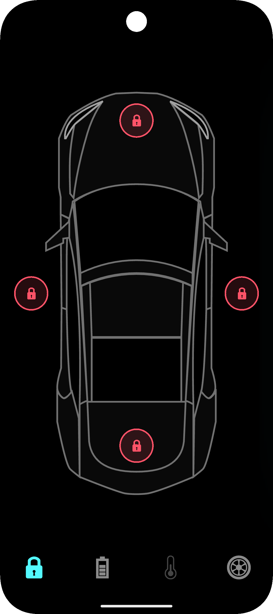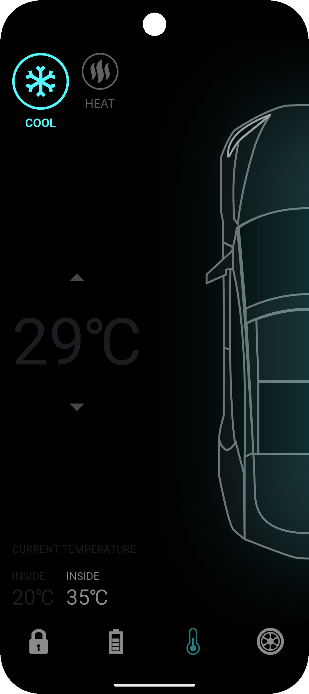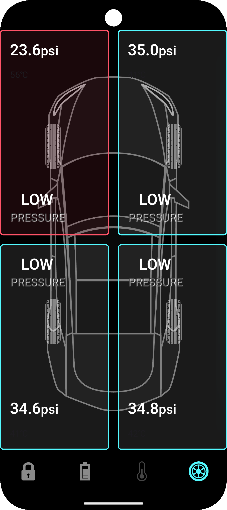

# dem24
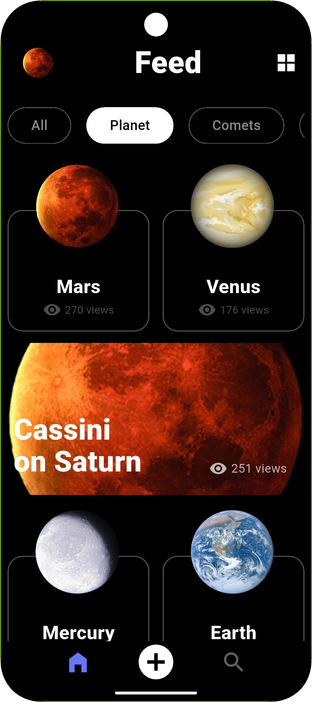

# dem25
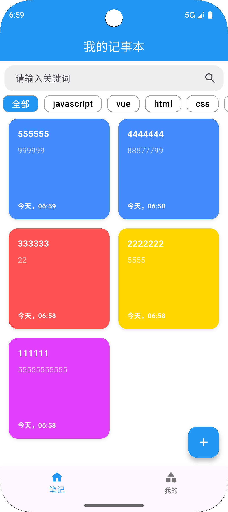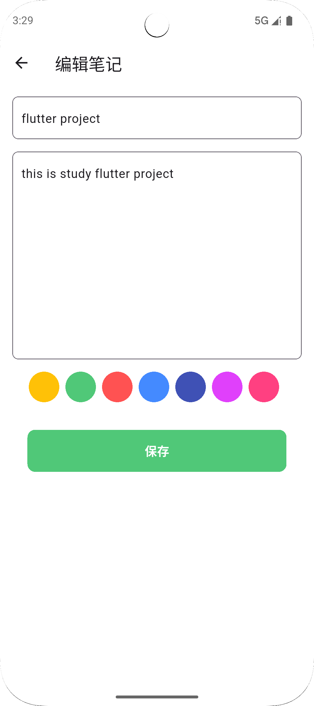


# 常见命令
```bash
# 添加 readmore 依赖包
flutter pub add readmore

# android studio 格式化代码
Ctrl + Alt + L

# vscode 快速包裹 子元素
Ctrl + Shift + R
```